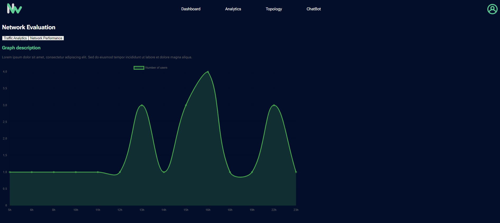

# NetWise_DevFest24 - Bandwidth Management System

## Project Overview :

**NetWise** is a bandwidth management and optimization system developed for the DevFest Algiers Hackathon. The solution aims to improve the **Quality of Experience (QoE)** for satellite broadband users over shared bandwidth by leveraging Traffic Shaping techniques. The system features an AI-powered chatbot for managing bandwidth data, CRUD operations, and generating detailed PDF reports based on user requests.

## Key Features

- **AI-Powered Chatbot (Django REST Backend):**

  - The chatbot interacts with network admins to analyze
  - bandwidth usage and manage network resources.
  - Provides data analytics based on historical bandwidth consumption.
  - Generates automated PDF reports using LangChain for real-time data analysis.

- **Bandwidth Management API (Node.js Backend):**

  - Handles the core functionality for monitoring and controlling bandwidth allocation.
  - Uses a RESTful API to expose the network traffic data and provide tools for managing client bandwidth.
  - Allows admins to set maximum bandwidth allocations for different clients through a dashboard.

## Project Tree Structure

```csharp
NETWISE_2/
│
├── back/
│   ├── AI_API/
│   │   ├── chatbot/
│   │   ├── document_agent/
│   │   ├── mon_environnement/
│   │   └── venv/
│   ├── .dockerignore
│   ├── .env
│   ├── .gitignore
│   ├── bandwidth_report_20241019_...
│   ├── bandwidth_report_20241019_...
│   ├── db.sqlite3
│   ├── Dockerfile
│   ├── get-pip.py
│   ├── manage.py
│   ├── README.Docker.md
│   ├── requirements.txt
│   ├── models/
│   ├── routers/
│   │   ├── authMiddleware.js
│   │   ├── authMiddlewareProv.js
│   │   ├── authMiddlewareSocket.js
│   │   ├── Dockerfile
│   │   ├── endpoints.txt
│   │   └── server.js
│   ├── node_modules/
│   ├── package-lock.json
│   ├── package.json
│   └── README.md
│
├── front/
│   ├── node_modules/
│   ├── public/
│   ├── src/
│   ├── .dockerignore
│   ├── .gitignore
│   ├── Dockerfile
│   ├── eslint.config.js
│   ├── index.html
│   ├── package-lock.json
│   ├── package.json
│   ├── README.Docker.md
│   ├── README.md
│   ├── tailwind.config.js
│   └── vite.config.js

```

## Screenshots




## Tech Stack

**Client:** React, Redux, TailwindCSS for styling

**Server:** Node.js (for general backend services) and Python (with Django REST API for AI-related services and assistants)

## Installation Instructions

### Backend Installation

1. Clone the repository:

```bash
git clone https://github.com/your-repo/NetWise.git
cd NetWise/back
```

2. Install Node.js dependencies:

```bash
npm install
```

3. Run the backend server:

```bash
node server.js
```

4. MongoDB connection:

- Ensure MongoDB is running.
- Make the .env file with MongoDB connection details

### Frontend Installation

1. Navigate to the frontend folder:

```bash
cd ../front
```

2. Install dependencies:

```bash
npm install
```

3. Start the development server:

```bash
npm run dev
```

### AI Service

1. Activate the virtual environment:

```bash
cd ../back/AI_API
.\venv\Scripts\activate
```

2. Install Python dependencies (use a requirements.txt):

```bash
pip install -r requirements.txt
```

3, Run the AI server (Django):

```bash
python manage.py runserver

```

## .env variables needed

### AI_API

```env
DB_LINK=your_db_link_here
CODE_CORTEX=your_code_cortex_key_here
SECRET_KEY=your_ai_secret_key_here
```

### back (for node)

```env
SECRET_PROVISOIR=your_temp_secret_here
SECRET=your_secret_here
DATABASE_URI=your_database_uri_here
NODE_ENV=production  # or 'development' based on your environment
```
